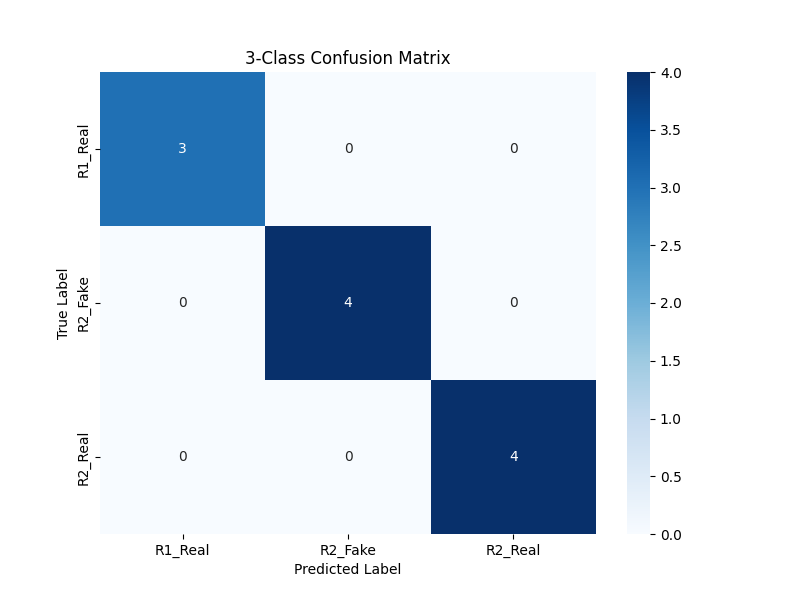
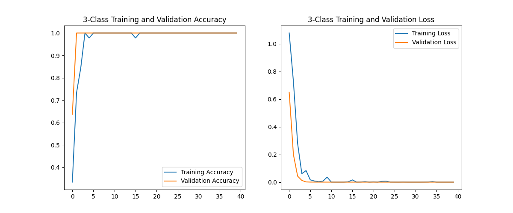

# 🤖 Kung Fu Scroll Classifier (3-Class Model)

### 📘 Overview
This task aimed to develop a **machine learning classifier** based on the *Robocon 2026 – Kung Fu Scroll Recognition Patterns*. This final version classifies symbols into three distinct categories based on color and shape: `R1_Real`, `R2_Real`, and `R2_Fake`.

---

### 🎯 Objective
Create a vision-based model that can:
- Classify symbols into `R1_Real`, `R2_Real`, or `R2_Fake`.

---

### 🧩 Task Breakdown & Execution

#### 1. Dataset Preparation
- **Source:** Symbols were extracted from Appendix 4.3 of the official `Robocon 2026 RULEBOOK.pdf`.
- **Classes & Logic:**
    - `R1_Real`: The Robocon Logo shape on a **RED** background.
    - `R2_Real`: The 15 Oracle Bone shapes on a **RED** background.
    - `R2_Fake`: The 15 Random Pattern shapes on a **BLUE** background.
- **Structure:** Images were organized into `dataset/train` (45 images) and `dataset/validation` (11 images) directories, with subdirectories for the three classes.
- **Preprocessing:** Images were loaded, resized to 128x128 pixels, and pixel values were rescaled to [0, 1]. No separate data augmentation steps were used in the final successful model.

#### 2. Model Development
- **Framework:** TensorFlow / Keras.
- **Architecture:** A simple Convolutional Neural Network (CNN) was built from scratch.
    - Input (128x128x3) -> Rescaling
    - Conv2D (32 filters) -> MaxPooling2D
    - Conv2D (64 filters) -> MaxPooling2D
    - Conv2D (128 filters) -> MaxPooling2D
    - Flatten -> Dense (128 units) -> Dropout (0.5)
    - Dense Output (3 units, Softmax)
- **Training:** The model was trained using the Adam optimizer and Sparse Categorical Crossentropy loss for 40 epochs.

#### 3. Evaluation
- The model was evaluated on the unseen validation set.
- **Performance Metrics:** Perfect scores were achieved across the board.
    - **Accuracy:** 100%
    - **Precision, Recall, F1-Score:** 1.00 for all classes (`R1_Real`, `R2_Fake`, `R2_Real`).

    **Classification Report:**
    ```
                  precision    recall  f1-score   support

         R1_Real       1.00      1.00      1.00         3
         R2_Fake       1.00      1.00      1.00         4
         R2_Real       1.00      1.00      1.00         4

        accuracy                           1.00        11
       macro avg       1.00      1.00      1.00        11
    weighted avg       1.00      1.00      1.00        11
    ```

- **Confusion Matrix:**
    
    *(The matrix shows zero misclassifications.)*

- **Training Curves:**
    
    *(Curves show rapid convergence to 100% validation accuracy and near-zero loss.)*


#### 4. Documentation & Conclusion
- The simplified 3-class approach, combined with distinct color features for each class, allowed the simple CNN model to achieve **100% accuracy** on the validation data.
- Code includes comments, and variable names are clear.
- This report (`report.md`) summarizes the process and results.

---

### 📦 Deliverables
- ✅ Trained model file: `symbol_classifier_3class.keras`
- ✅ Training code: `train.py`
- ✅ Testing code: `test.py`
- ✅ Final report (`Report.md`) with metrics and visualizations:
    - `training_results_3class.png`
    - `confusion_matrix_3class.png`
- ✅ The `dataset` folder containing the prepared images.

---

